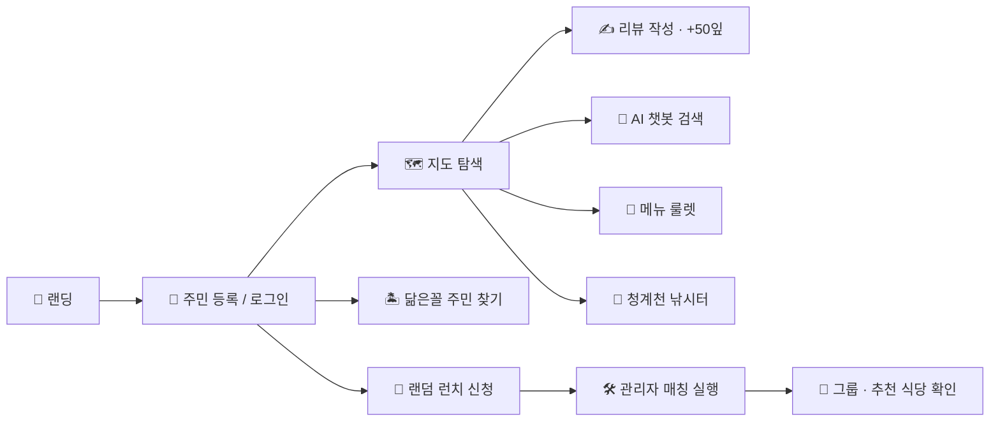
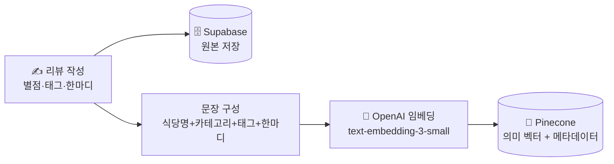
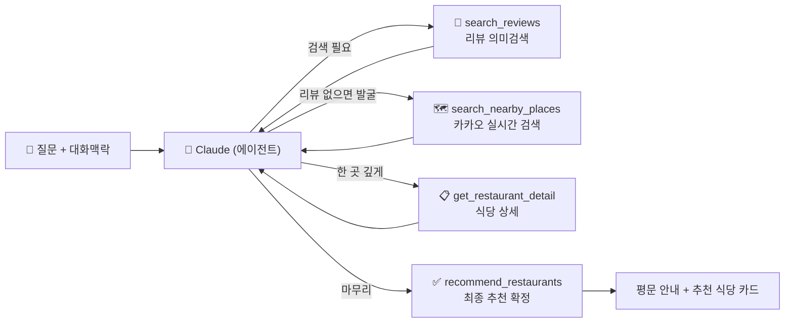
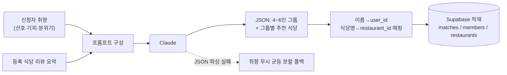
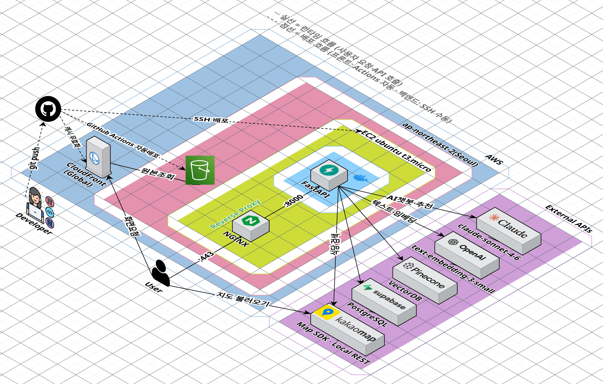
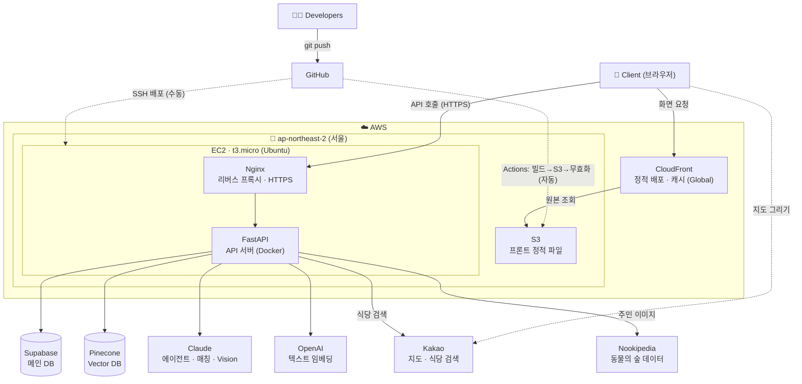
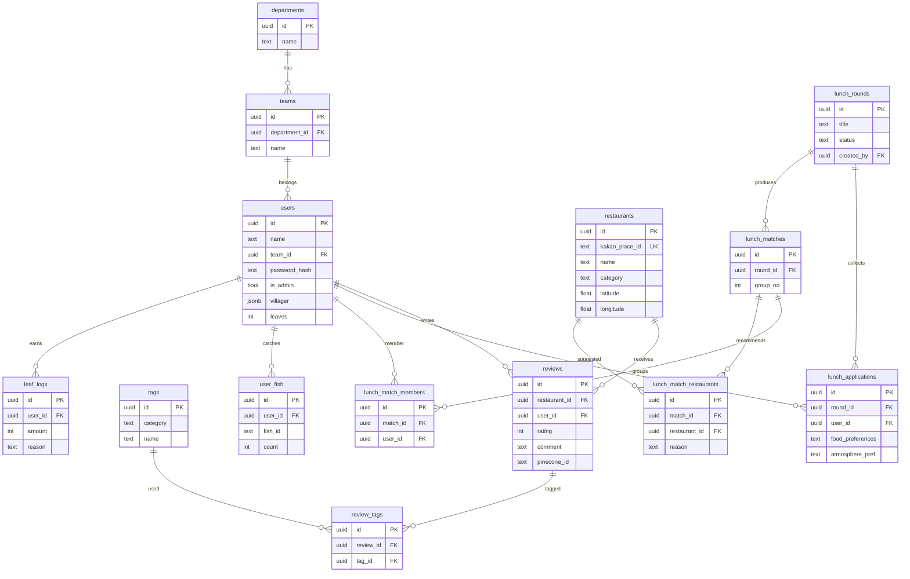

# 🍱 Biz Lunch Lab

> **기업사업본부 AI 기반 맛집 탐색 · 랜덤 런치 매칭 플랫폼**
> 광화문 권역에서 동료들과 점심 맛집을 모으고, AI로 찾고, 랜덤으로 함께 떠나는 기업사업본부만의 "점심 섬" 🌿

<p>
  
  
  
  
</p>

- 🌐 **Live**: https://d1nn2omasifg5e.cloudfront.net
- 🔗 **API**: https://biz-lunch-lab.duckdns.org

---

## 1. 프로젝트 소개

| 항목 | 내용 |
|------|------|
| **서비스명** | Biz Lunch Lab |
| **대상** | 기업사업본부 임직원 |
| **목적** | 광화문 권역 점심 맛집 정보를 사내에 모으고, AI 추천·랜덤 런치로 **점심 고민과 부서 간 교류 단절**을 해결 |
| **컨셉** | 동물의 숲 톤의 "점심 무인도" — 가볍고 친근한 사내 도구 |

### 기대 효과
- 🍽️ **점심 결정 피로 감소** — 검증된 사내 리뷰 + AI 에이전트 추천 + 메뉴 룰렛
- 🤝 **부서 간 네트워킹** — 취향 기반 랜덤 런치 매칭으로 새로운 동료와 식사
- 📚 **사내 맛집 지식 축적** — 리뷰·태그가 쌓일수록 추천 품질 향상, 나뭇잎 보상·낚시터 등 게임 요소로 참여 유도

---

## 2. 주요 기능

| 기능 | 설명 |
|------|------|
| 🔐 **인증** | 담당·팀·이름 + 4자리 PIN(bcrypt) 기반 회원가입/로그인, JWT 발급 |
| 🗺️ **맛집 지도** | 카카오 로컬 API로 광화문 권역 **음식점·카페 실시간 검색** → 식당 정보 보기(리뷰 없어도) → 바로 리뷰 작성. 리뷰 있는 곳은 별점·태그·동료 리뷰까지 표시 |
| 🤖 **AI 챗봇 (또리)** | **Tool Use 기반 AI 에이전트** — Claude가 리뷰 검색·식당 상세·카카오 실시간 검색 도구를 스스로 호출해 추천. 평문 답변 + 추천 식당 카드, SSE 스트리밍 (→ [§4](#4-ai-파이프라인--rag에서-에이전트까지)) |
| ✍️ **리뷰 작성** | 카카오 검색(또는 지도에서 식당 선택) → 별점·태그(4분류)·코멘트 → 임베딩 후 Pinecone 색인. 작성 보상 **나뭇잎 +50잎**(알찬 리뷰는 +20잎 보너스) |
| 🎲 **메뉴 룰렛** | 8개 카테고리 스피너 → **사내 리뷰 맛집과 카카오 실시간 발굴을 반반 혼합** 추천. 리뷰 없는 식당은 "🌱 새로운 발견" 뱃지와 함께 첫 리뷰 작성으로 연결 |
| 🍱 **랜덤 런치** | 취향 입력 후 신청 → 관리자 매칭 실행 → **Claude가 4~6인 그룹 + 식당 추천** |
| 🏝️ **닮은꼴 주민 찾기** | 성격 퀴즈(+선택 사진) → 동물의 숲 주민 413명 중 **Claude Vision이 닮은꼴 1명 + 러너업 2명** 선정. 결과는 프로필로 저장 |
| 🎣 **청계천 낚시터** | 실사 영상 배경의 낚시 미니게임. **실제 시각·계절(KST)에 맞는 어종 46종**이 출현하고, 잡은 물고기는 도감에 기록·판매해 나뭇잎 획득 (→ [§4.5](#45-청계천-낚시터--서버-판정-설계)) |
| 👤 **마이페이지** | 내 닮은꼴 주민 프로필 + 내 리뷰 목록 수정/삭제 |
| 🛠️ **관리자** | 런치 회차 생성/마감/매칭, 구성원 PIN 리셋 |
| 🌗 **다크 모드** | 라이트/다크 테마 토글 (지도 타일까지 야간 톤 전환) |

---

## 3. 사용 흐름 & 시나리오



**예시 시나리오 — "신규 입사자 민지의 첫 점심"**
1. 사내 링크로 접속 → **담당·팀·이름·PIN**으로 가입.
2. **닮은꼴 주민 찾기** 퀴즈로 내 아바타 주민을 만들고 시작.
3. **지도**에서 동료들이 남긴 리뷰 맛집을 둘러보고, "국밥"으로 검색해 마커로 이동.
4. **또리 AI 챗봇**에 "조용하고 가성비 좋은 점심 추천해줘" → 사내 리뷰 기반 답변.
5. 다녀온 곳은 **리뷰 작성**(별점·태그·코멘트) → 나뭇잎 보상 + 다음 사람을 위한 데이터로 축적.
6. 새 동료와 친해지고 싶으면 **랜덤 런치** 신청 → 관리자가 매칭하면 Claude가 묶어준 **내 그룹**을 확인.
7. 점심시간이 남으면 **청계천 낚시터**에서 이 계절에만 잡히는 물고기로 도감 채우기.

---

## 4. AI 파이프라인 — RAG에서 에이전트까지

### 4.1 리뷰 색인 — 검색 가능한 사내 지식으로 저장

리뷰를 남기면 원본과 의미 벡터가 각각 저장된다.



- **Supabase (PostgreSQL)** — 리뷰 원본(별점·태그·코멘트) 보관. 수정·삭제 시 Pinecone과 동기화.
- **OpenAI 임베딩** — 리뷰 문장을 512차원 벡터로 변환. 의미가 가까운 문장("조용한" ↔ "한적한")이 벡터 공간에서도 가깝다.
- **Pinecone (벡터 DB)** — 의미 유사도 검색 전용. 식당명·별점·태그를 메타데이터로 함께 저장.

### 4.2 AI 에이전트 (Tool Use) — Claude가 스스로 검색하고 판단

또리는 "한 번 검색 → 한 번 생성"의 고정 RAG 파이프라인이 아니라, Claude가 **도구를 스스로 판단해 호출하는 에이전트 루프**로 동작한다.



| 도구 | 역할 |
|------|------|
| `search_reviews` | 사내 리뷰 의미검색(Pinecone). 후속 질문이면 대화 맥락을 반영해 query를 새로 구성 |
| `search_nearby_places` | 사내 리뷰에 마땅한 곳이 없을 때 카카오로 광화문 권역 실시간 검색 — 리뷰 없는 신규 식당까지 발굴 |
| `get_restaurant_detail` | 특정 식당의 전체 리뷰·태그 상세 조회 |
| `recommend_restaurants` | 최종 답변·추천 식당을 구조화 출력으로 확정(finish) |

**설계 포인트**
- **후속 질문 맥락 유지** — "거기 근처 다른 데는?" 같은 질문에 에이전트가 맥락을 반영해 직접 재검색
- **구조화 출력** — 최종 추천을 도구 입력(검증된 JSON)으로 받아 정규식 파싱 제거, 식당은 `restaurant_id`로 지정해 이름 매칭 오류 차단
- **근거 기반 답변** — 등록된 리뷰·검색 결과 범위 안에서만 답하고, 근거가 없으면 지어내는 대신 첫 리뷰 작성을 안내
- **프롬프트 캐싱** — 시스템 프롬프트·도구 정의(고정 프리픽스)에 `cache_control`을 적용, 멀티라운드 반복 프리픽스를 캐시 읽기(약 0.1배 단가)로 처리
- **Adaptive thinking** — 도구 선택 전 Claude가 스스로 추론 깊이를 조절 (`claude-sonnet-4-6`)
- **SSE 스트리밍** — `POST /api/chat/stream`으로 진행 상태(🔎 검색 중 → 📋 확인 중 → ✨ 정리 중)와 최종 안내문을 토큰 단위 실시간 전송. 실패 시 비스트리밍 `POST /api/chat` 폴백

> 구현: [`backend/app/services/agent_tools.py`](backend/app/services/agent_tools.py)(도구 정의·핸들러) · [`backend/app/services/rag_service.py`](backend/app/services/rag_service.py)(에이전트 루프 + SSE) · [`backend/app/routers/chat.py`](backend/app/routers/chat.py)

### 4.3 랜덤 런치 매칭 (Claude)

신청자 취향과 사내 식당 리뷰 요약을 함께 넣어, Claude가 그룹과 식당을 JSON으로 설계한다.



- 추천 식당은 **등록된 식당 목록 안에서만** 고르도록 제약(환각 방지), 미배정자는 첫 그룹에 보정 합류.

### 4.4 닮은꼴 주민 매칭 (Claude Vision)

1. 성격 퀴즈 답변으로 **주민 413명 전원을 점수화** → 상위 후보 12명 추출
2. Claude에게 (선택) 사용자 사진 + 후보 프로필을 주고 **최종 1명 + 러너업 2명** 선정 — `tool_choice` 강제로 검증된 JSON만 수신
3. Claude 호출 실패 시 점수 1위로 폴백

사진은 요청 처리 중 메모리에서만 사용하고 저장하지 않는다. 주민 전신 이미지는 [Nookipedia API](https://api.nookipedia.com)를 프록시(메모리 캐시)로 사용.

### 4.5 청계천 낚시터 — 서버 판정 설계

클라이언트 치트가 불가능하도록 **모든 판정을 서버가 소유**한다.

- **어종 추첨** — 실제 KST 월·시각으로 46종 중 지금 출현하는 어종을 필터링, 희귀도 가중치로 서버가 추첨
- **캐스팅 토큰** — 어떤 물고기가 무는지는 캐스팅 시점에 서버가 결정하고 **서명된 JWT(90초 TTL)** 로 전달. 클라이언트는 타이밍 미니게임만 수행하고, 성공 시 토큰을 반환해 확정(`land`). 토큰 `jti` 재사용 차단으로 리플레이 방지
- **난이도** — 어려운 물고기일수록 입질 반응 허용시간이 짧다 (950ms → 480ms)
- **나뭇잎 경제** — 잡은 물고기는 도감(`user_fish`)에 기록되고 판매하면 나뭇잎 적립. 리뷰 보상과 함께 모든 변동이 `leaf_logs` 장부에 기록

---

## 5. AWS 아키텍처 & 기술 스택



> 실선 = 런타임 흐름 (사용자 요청·API 호출) · 점선 = 배포 흐름 — **프론트는 GitHub Actions 자동 배포**, 백엔드는 SSH 수동 배포

<details>
<summary>논리 흐름도 (mermaid)</summary>



</details>

### AWS 구성 포인트

| 구성 | 내용 |
|------|------|
| **S3 + OAC** | 프론트 버킷(`biz-lunch-lab-frontend`)은 퍼블릭 접근 전면 차단(Block public access), **Origin Access Control**로 CloudFront만 접근 허용 |
| **CloudFront** | 글로벌 엣지 캐시 + HTTPS. SPA 라우팅은 커스텀 에러 응답(403/404 → `/index.html`, 200)으로 처리 |
| **EC2 상시 구동** | `t3.micro`(서울 리전)에 Docker 컨테이너로 FastAPI 상시 실행(`--restart unless-stopped`) — 무료 PaaS의 콜드 스타트 문제 원천 제거 |
| **Nginx + Let's Encrypt** | 80/443 → 내부 8000 리버스 프록시, `certbot`으로 인증서 자동 발급·갱신. 도메인은 DuckDNS 서브도메인을 Elastic IP에 연결 |
| **GitHub Actions 자동 배포** | main에 `frontend/**` push 시 빌드 → `aws s3 sync` → CloudFront invalidation까지 자동. 배포 전용 IAM 유저는 **최소 권한**(해당 버킷 3개 액션 + `cloudfront:CreateInvalidation`)만 부여, 키는 GitHub Secrets로 관리 |

### 기술 스택

**Frontend**


**Backend**


**Data & AI**


**Deploy & Dev**


### 기술 정리

| 기술 | 용도 | 사용 방식 |
|------|------|-----------|
| **Anthropic Claude** (`claude-sonnet-4-6`) | AI 에이전트 · 런치 매칭 · 닮은꼴 Vision | Tool Use 에이전트 루프(챗봇), JSON 구조화 출력(매칭·닮은꼴), 프롬프트 캐싱·adaptive thinking 적용 |
| **OpenAI 임베딩** (`text-embedding-3-small`) | 리뷰·질문의 의미 벡터화 | 512차원 벡터로 변환해 의미 유사도 검색의 기반 |
| **Pinecone** (벡터 DB) | 리뷰 의미검색 | 리뷰 벡터 + 식당·별점·태그 메타데이터 저장, top-k 검색 |
| **Supabase** (PostgreSQL) | 원본 데이터 보관 | 사용자·리뷰·식당·런치·도감·나뭇잎 장부. 접근은 백엔드 API(JWT)로만 통제 |
| **Kakao** | 지도 + 식당 검색 | 화면 지도는 JS SDK, 검색은 로컬 REST API(음식점+카페, 광화문 반경 2km) |
| **Nookipedia** | 동물의 숲 주민 데이터 | 주민 전신 이미지 프록시(메모리 캐시), 주민 프로필은 정적 데이터셋(`villagers.json`) 내장 |
| **bcrypt + JWT** | 인증·게임 판정 보안 | PIN은 bcrypt 해시 저장, 로그인 JWT 발급. 낚시 캐스팅 토큰도 동일 서명 체계(재사용 차단) |
| **React · Vite · Zustand** | SPA 화면·상태 관리 | 페이지·로그인 상태 관리, 서버 호출은 axios |
| **Docker** | 배포 환경 일관성 | `backend/Dockerfile` 이미지 빌드 → EC2 컨테이너 상시 실행 |
| **Nginx + Let's Encrypt** | HTTPS 리버스 프록시 | 80/443 → 내부 8000 전달, `certbot` 자동 갱신 |
| **GitHub Actions** | 프론트 CI/CD | push → 빌드 → S3 sync → CloudFront invalidation 자동화 |

---

## 6. 배포 & 운영

| 영역 | 플랫폼 | 방식 |
|------|--------|------|
| **Frontend** | S3 + CloudFront | **GitHub Actions 자동 배포** — main에 `frontend/**` push 시 `npm run build`(`.env.production` 적용) → `aws s3 sync --delete` → CloudFront invalidation(`/*`). Actions 탭에서 수동 실행(workflow_dispatch)도 가능 ([`deploy-frontend.yml`](.github/workflows/deploy-frontend.yml)) |
| **Backend** | AWS EC2 (`t3.micro`, Ubuntu 24.04, 서울 리전) | Docker 컨테이너 상시 구동. 배포는 SSH 접속 후 `git pull` → `docker build` → 컨테이너 재생성 (수동, [`backend/Dockerfile`](backend/Dockerfile)) |

- 비밀 키는 저장소에 두지 않는다 — 백엔드는 EC2의 `.env`(`docker run --env-file`), 프론트 배포 자격증명은 GitHub Secrets.
- 프론트 `VITE_*` 값은 빌드 결과물에 노출되는 공개 값(도메인 제한 키)만 사용, [`frontend/.env.production`](frontend/.env.production)으로 커밋.

---

## 7. 설계 문서

### ERD



> 전체 정의: [`backend/db/schema.sql`](backend/db/schema.sql)

### API

| 영역 | 메서드 & 엔드포인트 | 설명 |
|------|------|------|
| 인증 | `POST /api/auth/signup` · `POST /api/auth/login` · `GET /api/auth/me` | 회원가입 / 로그인 / 내 정보 |
| 조직 | `GET /api/departments` · `GET /api/departments/{id}/teams` | 담당 / 팀 목록 (드롭다운) |
| 태그 | `GET /api/tags` | 리뷰 태그 목록 (4분류) |
| 식당 | `GET /api/restaurants` · `GET /api/restaurants/{id}` · `GET /api/restaurants/by-kakao/{kakao_place_id}` · `GET /api/restaurants/kakao/search` · `GET /api/restaurants/roulette` | 마커 목록 / 상세 / 카카오 place_id로 상세 / 카카오 검색 / 룰렛(DB+카카오 발굴 혼합) |
| 리뷰 | `POST /api/reviews` · `PUT /api/reviews/{id}` · `DELETE /api/reviews/{id}` · `GET /api/reviews/my` | 작성(나뭇잎 보상) / 수정 / 삭제 / 내 리뷰 — Pinecone 동기화 |
| 챗봇 | `POST /api/chat` · `POST /api/chat/stream` | Tool Use 에이전트 맛집 추천 (일반 / SSE 스트리밍) |
| 랜덤 런치 | `GET·POST /api/lunch/rounds` · `PATCH /api/lunch/rounds/{id}/status` · `POST /api/lunch/apply` · `DELETE /api/lunch/apply/{id}` · `GET /api/lunch/apply/count` · `POST /api/lunch/match` · `GET /api/lunch/result/{id}` | 회차 / 신청 / 매칭 / 결과 |
| 닮은꼴 주민 | `POST /api/villager/match` · `POST /api/villager/profile` · `GET /api/villager/render` | 퀴즈+사진 매칭 / 프로필 저장 / 주민 전신 이미지 |
| 낚시터 | `GET /api/fishing/pond` · `POST /api/fishing/cast` · `POST /api/fishing/land` · `GET /api/fishing/collection` · `POST /api/fishing/sell` | 물때 정보 / 캐스팅(토큰 발급) / 낚기 확정 / 도감 / 판매 |
| 관리자 | `GET /api/admin/users` · `PATCH /api/admin/users/{id}/pin` · `GET /api/admin/rounds` | 사용자·회차 관리 (관리자 전용) |

> 인터랙티브 문서: https://biz-lunch-lab.duckdns.org/docs (Swagger UI)

---

## 8. 폴더 구조

```
biz-lunch-lab/
├── .github/workflows/
│   └── deploy-frontend.yml  # 프론트 자동 배포 (빌드 → S3 → CloudFront)
├── backend/                 # FastAPI
│   ├── app/
│   │   ├── routers/         # auth, departments, restaurants, reviews, tags,
│   │   │                    #   chat, lunch, villager, fishing, admin
│   │   ├── services/        # rag_service(에이전트 루프), agent_tools(Tool Use 도구),
│   │   │                    #   embedding, pinecone_client, kakao, lunch_match,
│   │   │                    #   villager_match(Claude Vision), fishing, leaf_economy
│   │   ├── data/            # villagers.json(주민 413명), fish.json(어종 46종)
│   │   ├── models/          # Pydantic 스키마
│   │   ├── auth.py          # JWT · bcrypt · 권한
│   │   └── main.py          # 앱 엔트리 + CORS
│   ├── db/                  # schema.sql, seed.sql, 마이그레이션 스크립트
│   └── Dockerfile           # EC2 배포용 이미지
├── frontend/                # React + Vite
│   └── src/
│       ├── pages/           # Landing, Login, Signup, Map, ReviewWrite, Roulette,
│       │                    #   Lunch, VillagerMatch, Fishing, MyPage, Admin
│       ├── components/      # Map, ChatPanel, RestaurantPanel, common
│       ├── api/             # axios 클라이언트별 API
│       └── store/           # zustand (auth, theme)
└── README.md
```
