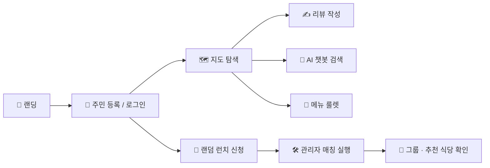
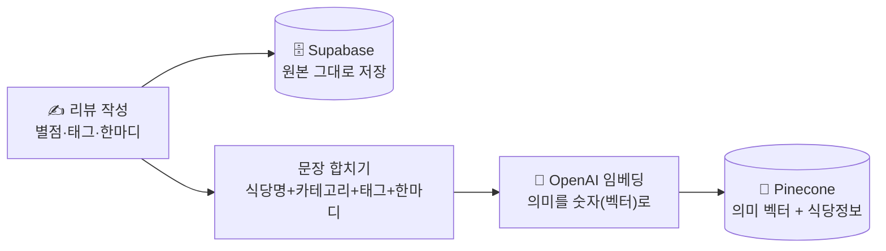
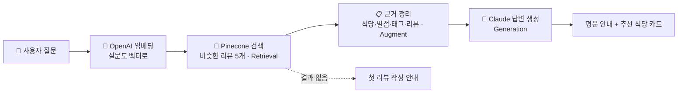
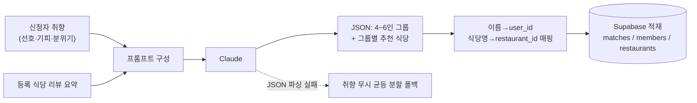
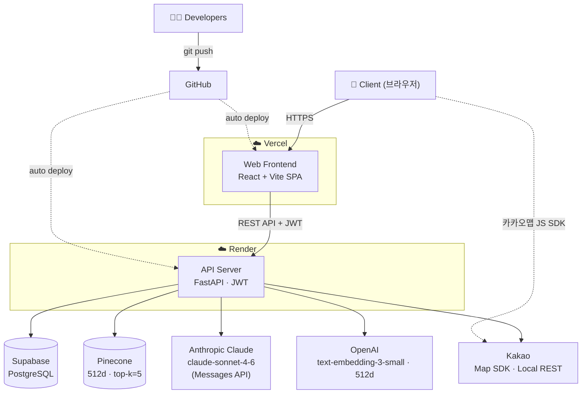
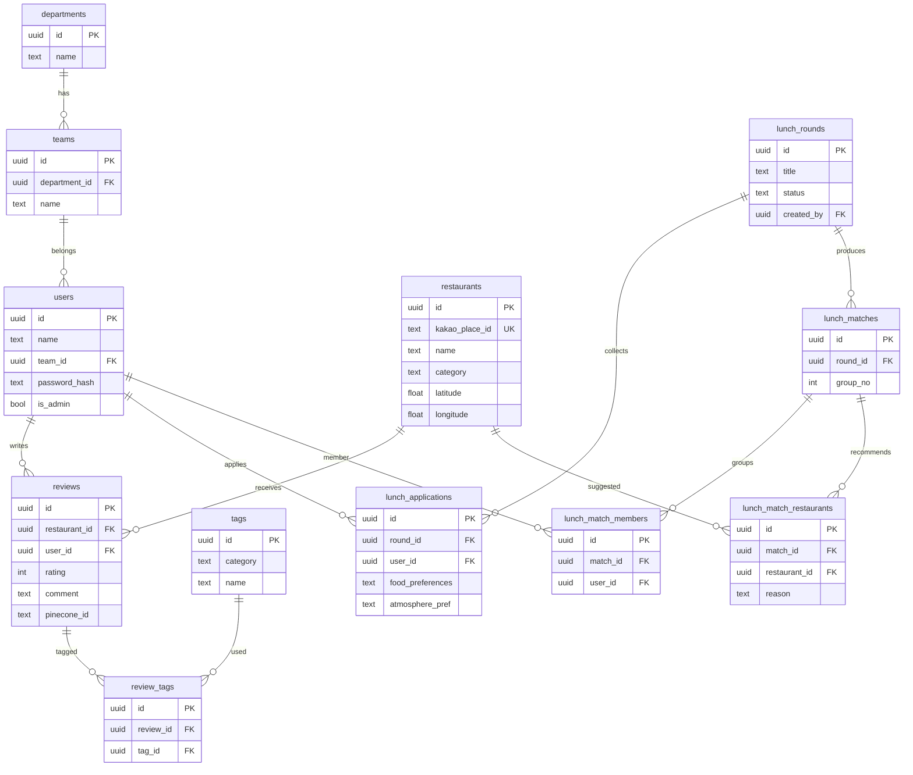

# 🍱 Biz Lunch Lab

> **기업사업본부 AI 기반 맛집 탐색 · 랜덤 런치 매칭 플랫폼**
> 광화문 권역에서 동료들과 점심 맛집을 모으고, AI로 찾고, 랜덤으로 함께 떠나는 기업사업본부만의 "점심 섬" 🌿

<p>
  
  
  
</p>

- 🌐 **Live**: https://biz-lunch-lab.vercel.app
- 🔗 **API**: https://biz-lunch-lab-api.onrender.com

---

## 1. 프로젝트 소개

| 항목 | 내용 |
|------|------|
| **서비스명** | Biz Lunch Lab |
| **대상** | 기업사업본부 임직원 |
| **목적** | 광화문 권역 점심 맛집 정보를 사내에 모으고, AI 추천·랜덤 런치로 **점심 고민과 부서 간 교류 단절**을 해결 |
| **컨셉** | 동물의 숲 톤의 "점심 무인도" — 가볍고 친근한 사내 도구 |

### 기대 효과
- 🍽️ **점심 결정 피로 감소** — 검증된 사내 리뷰 + AI 추천 + 메뉴 룰렛
- 🤝 **부서 간 네트워킹** — 취향 기반 랜덤 런치 매칭으로 새로운 동료와 식사
- 📚 **사내 맛집 지식 축적** — 리뷰·태그가 쌓일수록 추천 품질 향상 (RAG)

---

## 2. 주요 기능

| 기능 | 설명 |
|------|------|
| 🔐 **인증** | 담당·팀·이름 + 4자리 PIN(bcrypt) 기반 회원가입/로그인, JWT 발급 |
| 🗺️ **맛집 지도** | 카카오 로컬 API로 광화문 권역 **음식점·카페 실시간 검색** → 식당 정보 보기(리뷰 없어도) → 바로 리뷰 작성. 리뷰 있는 곳은 별점·태그·동료 리뷰까지 표시 |
| 🤖 **AI 챗봇 (또리)** | RAG — 사내 리뷰를 임베딩·검색해 Claude가 추천. 답변은 **평문 + 추천 식당 카드**(별점·태그·근거 리뷰), 대화 히스토리 유지 |
| ✍️ **리뷰 작성** | 카카오 검색(또는 지도에서 식당 선택) → 별점·태그(4분류)·코멘트 → 임베딩 후 Pinecone 색인 |
| 🎲 **메뉴 룰렛** | 8개 카테고리 스피너 → 해당 종류 식당 랜덤 추천 |
| 🍱 **랜덤 런치** | 취향 입력 후 신청 → 관리자 매칭 실행 → **Claude가 4~6인 그룹 + 식당 추천** |
| 👤 **마이페이지** | 내 리뷰 목록 수정/삭제 |
| 🛠️ **관리자** | 런치 회차 생성/마감/매칭, 구성원 PIN 리셋 |
| 🌗 **다크 모드** | 라이트/다크 테마 토글 (지도 타일까지 야간 톤 전환) |

---

## 3. 사용 흐름 & 시나리오



**예시 시나리오 — "신규 입사자 민지의 첫 점심"**
1. 사내 링크로 접속 → **담당·팀·이름·PIN**으로 가입.
2. **지도**에서 동료들이 남긴 리뷰 맛집을 둘러보고, "국밥"으로 검색해 마커로 이동.
3.  **또리 AI 챗봇**에 "조용하고 가성비 좋은 점심 추천해줘" → 사내 리뷰 기반 답변.
4. 다녀온 곳은 **리뷰 작성**(별점·태그·코멘트) → 다음 사람을 위한 데이터로 축적.
5. 새 동료와 친해지고 싶으면 **랜덤 런치** 신청(선호 음식·기피·분위기 입력).
6. 관리자가 회차를 **매칭**하면, Claude가 취향 비슷한 4~6인 그룹 + 추천 식당을 묶어주고 결과 화면에서 **내 그룹**을 확인.

---

## 4. 핵심 동작

### 🤖 AI 챗봇 (또리) — "리뷰 등록"과 "AI 검색" 두 단계
또리는 동료들이 남긴 리뷰를 **검색해서 그 내용을 근거로 답하는** 챗봇입니다(**RAG** 기반). 동작은 **① 리뷰 등록(저장)** 과 **② AI 검색(답변)** 으로 나뉩니다.

#### ① 리뷰 등록 — 나중에 찾을 수 있게 저장
리뷰를 남기면 같은 내용이 **두 곳**에 저장됩니다.



- **Supabase (PostgreSQL)** — 리뷰 원본(별점·태그·코멘트)을 그대로 보관하는 일반 데이터베이스.
- **OpenAI 임베딩 (`text-embedding-3-small`)** — 리뷰 문장을 **숫자 묶음(벡터)** 으로 변환. 핵심은 *뜻이 비슷한 글은 비슷한 숫자가 된다*는 점입니다("조용한" ↔ "한적한"이 가까워짐).
- **Pinecone (벡터 DB)** — 이 의미 벡터를 식당명·별점·태그와 함께 저장. "비슷한 의미"로 빠르게 찾기 위한 검색 전용 DB. *(원본은 Supabase, 검색용 의미 벡터는 Pinecone — 두 군데 저장)*

#### ② AI 검색 — 관련 리뷰를 찾아 근거로 답변 생성 (RAG)
질문이 들어오면 등록된 리뷰 중 **의미가 비슷한 것**을 찾아 Claude가 그걸 근거로 답합니다.



1. **질문 임베딩** — 질문도 등록 때와 같은 OpenAI 임베딩으로 벡터화.
2. **검색 (Retrieval)** — Pinecone에서 질문과 의미가 가까운 리뷰 **5개**를 찾음.
3. **근거 주입 (Augment)** — 찾은 리뷰(식당·별점·태그·코멘트)를 정리해 Claude에게 줄 참고자료로 만듦.
4. **생성 (Generation)** — "이 리뷰만 근거로, 지어내지 말고" 지시 + 질문 + 대화 맥락을 **Anthropic Claude(`claude-sonnet-4-6`)** 에 전달.
5. **결과** — 마크다운 없는 **평문 1~2문장** + 백엔드가 묶은 **추천 식당 카드(상위 3곳: 카테고리·별점·태그·근거 리뷰)**. 카드 클릭 시 지도 포커스. 근거가 없으면 지어내지 않고 첫 리뷰 작성을 안내.

> 💡 **RAG = Retrieval-Augmented Generation**: LLM이 "아는 척" 지어내지 않도록, 먼저 **검색(Retrieval)** 으로 실제 리뷰를 찾고 → 그 **근거를 더해(Augment)** → **답을 생성(Generation)** 하는 방식. 그래서 또리는 등록된 사내 리뷰 범위 안에서만 답합니다.

### 🍱 랜덤 런치 매칭 (Claude)
신청자 취향과 사내 식당 리뷰 요약을 함께 넣어, Claude가 그룹과 식당을 JSON으로 설계합니다.



- 추천 식당은 **등록된 식당 목록 안에서만** 고르도록 제약(환각 방지), 미배정자는 첫 그룹에 보정 합류.

---

## 5. 아키텍처 & 기술 스택



### 기술 스택

**Frontend**


**Backend**


**Data & AI**


**Deploy & Dev**


### 기술 정리

| 기술 | 용도 (무엇을 위해) | 어떻게 사용 |
|------|--------------------|-------------|
| **Anthropic Claude** (`claude-sonnet-4-6`) | 챗봇 추천 답변 · 랜덤 런치 그룹 짜기 | 사내 리뷰를 근거 자료로 함께 넣어 Claude가 답을 생성. 매칭은 그룹을 표 형태(JSON)로 받아 처리(실패 시 균등 분할로 대체) |
| **OpenAI 임베딩** (`text-embedding-3-small`) | 글의 *의미*를 숫자로 바꿔 검색 가능하게 | 리뷰·질문 문장을 512칸짜리 숫자(벡터)로 변환 — 뜻이 비슷하면 숫자도 비슷 |
| **Pinecone** (벡터 DB) | 의미가 비슷한 리뷰를 빠르게 찾기 | 리뷰 벡터를 식당·별점·태그와 함께 저장하고, 질문과 가까운 리뷰 5개를 검색 |
| **Supabase** (PostgreSQL) | 사용자·리뷰·식당 등 *원본 데이터* 보관 | 백엔드에서 직접 읽고 씀. 접근 권한은 API 코드(로그인 토큰)로 통제 |
| **bcrypt + JWT** | 로그인 보안 | PIN은 bcrypt로 암호화해 저장, 로그인하면 JWT 토큰 발급(기본 7일 유효) |
| **Kakao** | 지도 표시 + 식당 검색 | 화면 지도는 JS SDK, 식당 검색은 로컬 REST API(음식점 + 카페) |
| **React · Vite · Zustand** | 웹 화면(SPA)과 화면 상태 관리 | 페이지·로그인 상태 관리. 서버 호출은 axios(잠든 서버 자동 재시도 포함) |

> 🛠️ 지금 RAG/매칭은 각 서비스 SDK(`anthropic`·`openai`·`pinecone`)를 **직접 연결**해 구성했습니다. *다음 단계로 **LangChain** 프레임워크 기반 RAG로 전환할 예정입니다.*

---

## 6. 설계 문서

### ERD



> 전체 정의: [`backend/db/schema.sql`](backend/db/schema.sql)

### API

| 영역 | 메서드 & 엔드포인트 | 설명 |
|------|------|------|
| 인증 | `POST /api/auth/signup` · `POST /api/auth/login` · `GET /api/auth/me` | 회원가입 / 로그인 / 내 정보 |
| 조직 | `GET /api/departments` · `GET /api/departments/{id}/teams` | 담당 / 팀 목록 (드롭다운) |
| 태그 | `GET /api/tags` | 리뷰 태그 목록 (4분류) |
| 식당 | `GET /api/restaurants` · `GET /api/restaurants/{id}` · `GET /api/restaurants/by-kakao/{kakao_place_id}` · `GET /api/restaurants/kakao/search` · `GET /api/restaurants/roulette` | 마커 목록 / 상세 / **카카오 place_id로 상세(리뷰 없으면 null)** / 카카오 검색(음식점+카페) / 룰렛 |
| 리뷰 | `POST /api/reviews` · `PUT /api/reviews/{id}` · `DELETE /api/reviews/{id}` · `GET /api/reviews/my` | 작성 / 수정 / 삭제 / 내 리뷰 (Pinecone 동기화) |
| 챗봇 | `POST /api/chat` | RAG 기반 맛집 추천 |
| 랜덤 런치 | `GET·POST /api/lunch/rounds` · `PATCH /api/lunch/rounds/{id}/status` · `POST /api/lunch/apply` · `DELETE /api/lunch/apply/{id}` · `GET /api/lunch/apply/count` · `POST /api/lunch/match` · `GET /api/lunch/result/{id}` | 회차 / 신청 / 매칭 / 결과 |
| 관리자 | `GET /api/admin/users` · `PATCH /api/admin/users/{id}/pin` · `GET /api/admin/rounds` | 사용자·회차 관리 (관리자 전용) |

> 인터랙티브 문서: 백엔드 실행 후 `http://localhost:8000/docs` (Swagger UI)

---

## 7. 로컬 실행

### 1) 환경변수
```bash
cp backend/.env.example backend/.env      # 실제 키 입력
cp frontend/.env.example frontend/.env    # 실제 키 입력
```
> `.env`는 커밋되지 않습니다. 키 목록은 각 `.env.example` 참고.

### 2) 백엔드
```bash
cd backend
python -m venv .venv
.venv\Scripts\activate            # Windows
pip install -r requirements.txt
uvicorn app.main:app --reload     # http://localhost:8000  (docs: /docs)
```

### 3) 프론트엔드
```bash
cd frontend
npm install
npm run dev                       # http://localhost:5173
```

### 4) DB 초기화 (최초 1회)
Supabase SQL Editor에서 순서대로 실행:
1. `backend/db/schema.sql`
2. `backend/db/seed.sql`

---

## 8. 배포 & 운영

### 배포 구성
| 영역 | 플랫폼 | 방식 |
|------|--------|------|
| **Frontend** | Vercel | `main` 푸시 시 자동 빌드·배포. SPA — 모든 경로를 `index.html`로 rewrite |
| **Backend** | Render (Web Service · Free) | `main` 푸시 시 자동 배포. `uvicorn app.main:app`, 헬스체크 `GET /health` ([`render.yaml`](render.yaml) 블루프린트) |

### 환경변수 (프로덕션)
| 설정 위치 | 키 | 용도 |
|-----------|----|----|
| **Vercel** | `VITE_API_URL` | 백엔드 API 주소 (예: `https://biz-lunch-lab-api.onrender.com`) |
| **Vercel** | `VITE_KAKAO_MAP_KEY` | 카카오맵 **JS SDK** 키 (지도 렌더) |
| **Render** | `SUPABASE_URL`, `SUPABASE_KEY` | Supabase 접속(서비스 키) |
| **Render** | `ANTHROPIC_API_KEY` | Claude (추천·매칭) |
| **Render** | `OPENAI_API_KEY` | 임베딩 |
| **Render** | `PINECONE_API_KEY`, `PINECONE_INDEX_NAME` | 벡터 DB |
| **Render** | `KAKAO_API_KEY` | 카카오 **로컬 REST**(식당 검색) |
| **Render** | `JWT_SECRET_KEY`, `JWT_EXPIRE_DAYS` | JWT 서명·만료 |
| **Render** | `FRONTEND_URL` | CORS 허용 도메인 (Vercel 프리뷰는 정규식으로 추가 허용) |

> 🗺️ **카카오 키 주의**: JS SDK 키는 **등록된 도메인에서만** 동작합니다. 로컬(`http://localhost:5173`)과 배포(Vercel) 도메인을 카카오 콘솔에 등록해야 지도가 뜹니다.

### ⚠️ Render 무료 플랜 콜드스타트
무료 Web Service는 **15분간 트래픽이 없으면 슬립**합니다. 슬립 직후 첫 요청은 서버를 깨우는 데 **30~60초**가 걸리거나 일시적으로 **502**가 납니다. 그래서 한동안 아무도 안 쓰다가 처음 접속하면 **로그인 화면에서 담당·팀 목록이 잠깐 비어 보일 수 있습니다.**

- **완화책 (적용됨)**: 프론트 `axios` 인터셉터가 콜드스타트성 오류(네트워크/타임아웃/502·503·504)를 **자동 재시도**해 깨우는 구간을 통과합니다.
- **권장 (상시 웜)**: [cron-job.org](https://cron-job.org) 또는 GitHub Actions로 **10~14분마다 `GET /health`** 핑 → 업무시간 동안 슬립 방지.
- **근본 해결 (계획)**: 백엔드를 상시 구동 환경인 **AWS EC2**로 이전해 콜드 스타트 자체를 제거할 예정입니다 (아래 [§9 보완사항 & 향후 개선](#9-보완사항--향후-개선) 참고).

> 증상이 "또" 보인다면, 대개 변경이 아직 배포되지 않았거나 서버가 막 슬립에서 깨는 중입니다. 데이터·코드 문제가 아니라 **무료 플랜 특성**입니다.

---

## 9. 보완사항 & 향후 개선


| # | 영역 | As-Is | To-Be |
|---|------|-------|-------|
| 1 | 배포·인프라 | Render 무료 플랜 — 콜드 스타트로 첫 응답 지연·간헐적 502 | AWS EC2 상시 구동으로 콜드 스타트 제거 |
| 2 | AI · RAG | 프레임워크 없이 직접 연결한 RAG 구성 | LangChain 체인화로 구조 표준화·확장성 확보 |

### 1. Render 콜드 스타트 → AWS EC2 이전

**As-Is (현재)**
- 백엔드가 Render 무료 플랜에서 구동되어, 15분간 트래픽이 없으면 인스턴스가 자동으로 슬립 상태로 전환
- 슬립 이후 첫 요청은 인스턴스를 깨우는 데 30~60초가 소요되거나 일시적으로 502가 발생하며, 이로 인해 로그인 화면에서 담당·팀 목록이 즉시 표시되지 않는 경우 발생
- 현재는 프론트엔드 `axios` 인터셉터의 자동 재시도로 완화하고 있으나, 무료 플랜의 구조적 제약상 콜드 스타트 자체를 제거 불가가

**To-Be (개선 후)**
- 백엔드를 AWS EC2 인스턴스로 이전하여 상시 구동(슬립 없음) 환경을 구성
- Docker/systemd 기반 상시 실행, Nginx 리버스 프록시, 도메인·HTTPS로 운영
- 콜드 스타트가 제거되어 첫 응답 지연과 간헐적 502가 해소되고, 일관된 응답 속도를 확보보

### 2. RAG LangChain 미적용 → LangChain 도입

**As-Is (현재)**
- RAG가 `anthropic`·`openai`·`pinecone`의 각 SDK를 직접 호출해 임베딩·검색·프롬프트 구성·답변 생성을 직접 연결한 구조
- 동작에는 문제가 없으나, 멀티턴 메모리·다단계 체인·외부 도구 연동 등으로 기능을 확장하기에는 로직이 분산되어 있어 유지보수가 번거로움움

**To-Be (개선 후)**
- RAG 파이프라인을 LangChain 프레임워크로 재구성
- `OpenAIEmbeddings` + Pinecone `VectorStore`(retriever) + `ChatAnthropic`을 표준 체인으로 묶음음
- 프롬프트·메모리·평가 관리와 기능 확장이 용이해지고 RAG 구조가 명확해짐, 관련 라이브러리는 이미 의존성에 포함되어 있어 코드 전환만 남아 있는 상태

---

## 10. 폴더 구조

```
biz-lunch-lab/
├── backend/                 # FastAPI
│   ├── app/
│   │   ├── routers/         # auth, departments, restaurants, reviews,
│   │   │                    #   tags, chat, lunch, admin
│   │   ├── services/        # embedding, pinecone, rag, kakao, lunch_match
│   │   ├── models/          # Pydantic 스키마
│   │   ├── auth.py          # JWT · bcrypt · 권한
│   │   └── main.py          # 앱 엔트리 + CORS
│   └── db/                  # schema.sql, seed.sql, 마이그레이션 스크립트
├── frontend/                # React + Vite
│   └── src/
│       ├── pages/           # Landing, Login, Signup, Map, ReviewWrite,
│       │                    #   Roulette, Lunch, MyPage, Admin
│       ├── components/      # Map, ChatPanel, RestaurantPanel, common
│       ├── api/             # axios 클라이언트별 API
│       └── store/           # zustand (auth, theme)
├── render.yaml              # Render 배포 블루프린트
└── README.md
```
