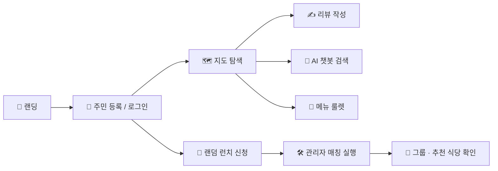
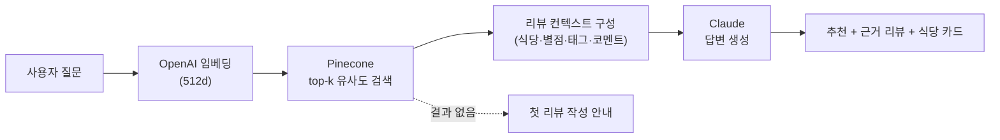
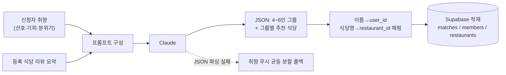
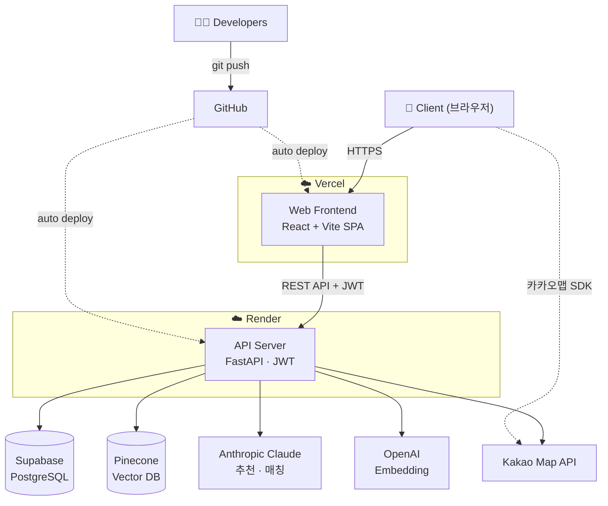
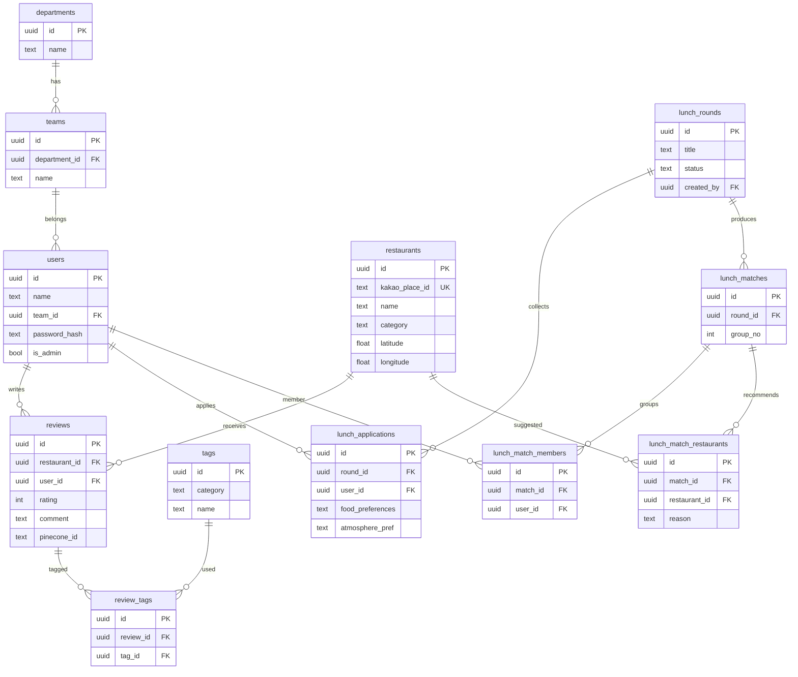

# 🍱 Biz Lunch Lab

> **기업사업본부 AI 기반 맛집 탐색 · 랜덤 런치 매칭 플랫폼**
> 광화문 권역에서 동료들과 점심 맛집을 모으고, AI로 찾고, 랜덤으로 함께 떠나는 "점심 섬" 🌿

<p>
  
  
  
</p>

- 🌐 **Live**: https://biz-lunch-lab.vercel.app
- 🔗 **API**: https://biz-lunch-lab-api.onrender.com

---

## 1. 프로젝트 소개

| 항목 | 내용 |
|------|------|
| **서비스명** | Biz Lunch Lab |
| **대상** | 기업사업본부 임직원 (약 169명) |
| **목적** | 광화문 권역 점심 맛집 정보를 사내에 모으고, AI 추천·랜덤 런치로 **점심 고민과 부서 간 교류 단절**을 해결 |
| **컨셉** | 동물의 숲 톤의 "점심 무인도" — 가볍고 친근한 사내 도구 |

### 기대 효과
- 🍽️ **점심 결정 피로 감소** — 검증된 사내 리뷰 + AI 추천 + 메뉴 룰렛
- 🤝 **부서 간 네트워킹** — 취향 기반 랜덤 런치 매칭으로 새로운 동료와 식사
- 📚 **사내 맛집 지식 축적** — 리뷰·태그가 쌓일수록 추천 품질 향상 (RAG)

---

## 2. 주요 기능

| 기능 | 설명 |
|------|------|
| 🔐 **인증** | 담당·팀·이름 + 4자리 PIN(bcrypt) 기반 회원가입/로그인, JWT 발급 |
| 🗺️ **맛집 지도** | 카카오맵 위에 리뷰 있는 식당 마커 표시, 이름·종류 검색, 마커 클릭 시 상세 패널 |
| 🤖 **AI 챗봇 (또리)** | LangChain RAG — 사내 리뷰를 임베딩·검색해 Claude가 추천 (대화 히스토리 유지) |
| ✍️ **리뷰 작성** | 카카오 검색으로 식당 선택 → 별점·태그(4분류 21개)·코멘트 → 임베딩 후 Pinecone 색인 |
| 🎲 **메뉴 룰렛** | 8개 카테고리 스피너 → 해당 종류 식당 랜덤 추천 |
| 🍱 **랜덤 런치** | 취향 입력 후 신청 → 관리자 매칭 실행 → **Claude가 4~6인 그룹 + 식당 추천** |
| 👤 **마이페이지** | 내 리뷰 목록 수정/삭제 |
| 🛠️ **관리자** | 런치 회차 생성/마감/매칭, 구성원 PIN 리셋 |
| 🌗 **다크 모드** | 라이트/다크 테마 토글 (지도 타일까지 야간 톤 전환) |

---

## 3. 사용 흐름 & 시나리오



**예시 시나리오 — "신규 입사자 민지의 첫 점심"**
1. 사내 링크로 접속 → **담당·팀·이름·PIN**으로 입도(가입).
2. **지도**에서 동료들이 남긴 리뷰 맛집을 둘러보고, "국밥"으로 검색해 마커로 이동.
3. 애매하면 **또리 챗봇**에 "조용하고 가성비 좋은 점심 추천해줘" → 사내 리뷰 기반 답변.
4. 다녀온 곳은 **리뷰 작성**(별점·태그·코멘트) → 다음 사람을 위한 데이터로 축적.
5. 새 동료와 친해지고 싶으면 **랜덤 런치** 신청(선호 음식·기피·분위기 입력).
6. 관리자가 회차를 **매칭**하면, Claude가 취향 비슷한 4~6인 그룹 + 추천 식당을 묶어주고 결과 화면에서 **내 그룹**을 확인.

---

## 4. 핵심 동작

### 🤖 AI 챗봇 (RAG 파이프라인)
사내에 등록된 **리뷰만** 근거로 답하며, 근거가 없으면 지어내지 않고 리뷰 작성을 안내합니다.



- **리뷰 작성 시**: 리뷰 텍스트(식당명·카테고리·태그·코멘트)를 임베딩 → `reviews.pinecone_id`로 Pinecone에 upsert. 수정/삭제 시 같이 동기화.

### 🍱 랜덤 런치 매칭 (Claude)
신청자 취향과 사내 식당 리뷰 요약을 함께 넣어, Claude가 그룹과 식당을 JSON으로 설계합니다.



- 추천 식당은 **등록된 식당 목록 안에서만** 고르도록 제약(환각 방지), 미배정자는 첫 그룹에 보정 합류.

---

## 5. 아키텍처 & 기술 스택



### 기술 스택

**Frontend**


**Backend**


**Data & AI**


**Deploy & Dev**


---

## 6. 설계 문서

### ERD



> 전체 정의: [`backend/db/schema.sql`](backend/db/schema.sql)

### API

| 영역 | 메서드 & 엔드포인트 | 설명 |
|------|------|------|
| 인증 | `POST /api/auth/signup` · `POST /api/auth/login` · `GET /api/auth/me` | 회원가입 / 로그인 / 내 정보 |
| 조직 | `GET /api/departments` · `GET /api/departments/{id}/teams` | 담당 / 팀 목록 (드롭다운) |
| 태그 | `GET /api/tags` | 리뷰 태그 목록 (4분류) |
| 식당 | `GET /api/restaurants` · `GET /api/restaurants/{id}` · `GET /api/restaurants/kakao/search` · `GET /api/restaurants/roulette` | 마커 목록 / 상세 / 카카오 검색 / 룰렛 |
| 리뷰 | `POST /api/reviews` · `PUT /api/reviews/{id}` · `DELETE /api/reviews/{id}` · `GET /api/reviews/my` | 작성 / 수정 / 삭제 / 내 리뷰 (Pinecone 동기화) |
| 챗봇 | `POST /api/chat` | RAG 기반 맛집 추천 |
| 랜덤 런치 | `GET·POST /api/lunch/rounds` · `PATCH /api/lunch/rounds/{id}/status` · `POST /api/lunch/apply` · `DELETE /api/lunch/apply/{id}` · `GET /api/lunch/apply/count` · `POST /api/lunch/match` · `GET /api/lunch/result/{id}` | 회차 / 신청 / 매칭 / 결과 |
| 관리자 | `GET /api/admin/users` · `PATCH /api/admin/users/{id}/pin` · `GET /api/admin/rounds` | 사용자·회차 관리 (관리자 전용) |

> 인터랙티브 문서: 백엔드 실행 후 `http://localhost:8000/docs` (Swagger UI)

---

## 7. 로컬 실행

### 1) 환경변수
```bash
cp backend/.env.example backend/.env      # 실제 키 입력
cp frontend/.env.example frontend/.env    # 실제 키 입력
```
> `.env`는 커밋되지 않습니다. 키 목록은 각 `.env.example` 참고.

### 2) 백엔드
```bash
cd backend
python -m venv .venv
.venv\Scripts\activate            # Windows
pip install -r requirements.txt
uvicorn app.main:app --reload     # http://localhost:8000  (docs: /docs)
```

### 3) 프론트엔드
```bash
cd frontend
npm install
npm run dev                       # http://localhost:5173
```

### 4) DB 초기화 (최초 1회)
Supabase SQL Editor에서 순서대로 실행:
1. `backend/db/schema.sql`
2. `backend/db/seed.sql`

---

## 8. 폴더 구조

```
biz-lunch-lab/
├── backend/                 # FastAPI
│   ├── app/
│   │   ├── routers/         # auth, departments, restaurants, reviews,
│   │   │                    #   tags, chat, lunch, admin
│   │   ├── services/        # embedding, pinecone, rag, kakao, lunch_match
│   │   ├── models/          # Pydantic 스키마
│   │   ├── auth.py          # JWT · bcrypt · 권한
│   │   └── main.py          # 앱 엔트리 + CORS
│   └── db/                  # schema.sql, seed.sql, 마이그레이션 스크립트
├── frontend/                # React + Vite
│   └── src/
│       ├── pages/           # Landing, Login, Signup, Map, ReviewWrite,
│       │                    #   Roulette, Lunch, MyPage, Admin
│       ├── components/      # Map, ChatPanel, RestaurantPanel, common
│       ├── api/             # axios 클라이언트별 API
│       └── store/           # zustand (auth, theme)
├── render.yaml              # Render 배포 블루프린트
└── README.md
```
